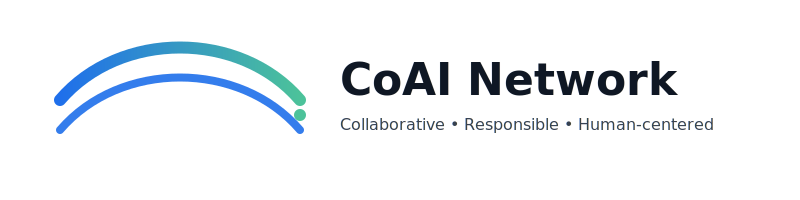

  

<h3 align="center">
Collaborative · Responsible · Human-Centered AI
</h3>

A global space where developers, researchers, ethicists, companies, and citizens work together 
to ensure that Artificial Intelligence benefits everyone.

---

## 🚀 Join & Participate

We are in our **Seed Phase** 🌱  
👋 Everyone is welcome: experts, students, companies, and curious citizens.

📌 Start here:
- 💬 Share your first thoughts:  
  👉 [Introduce yourself on Discussions](../../discussions/1)
- 🧩 Propose an idea or a project (Show & Tell soon)
- 🎤 Suggest events, talks or collaborations

If you want to contribute actively:
> **Become a Founding Member** — help shape governance, ethics and events.  
Send us a message in Discussions! ❤️

---

## 📖 Documentation

Explore our foundations:

- 🌍 [Mission](./docs/mission.md)
- ⭐ [Values](./docs/values.md)
- ⚖️ [Code of Ethics](./docs/code-of-ethics.md)
- 🤝 [Community Guidelines](./docs/community-guidelines.md)
- 🔐 [Privacy Policy](./docs/privacy-policy.md)
- ❓ [FAQ](./docs/faq.md)

---

## 🧭 Structure

coai-network/

├─ docs/ → mission, values, ethics & guidelines

├─ site/ → landing page and design assets

├─ assets/ → logos, banners, images

├─ events/ → talks, seminars, hackathons (coming soon)

└─ projects/ → proposals, research, showcases (coming soon)

---

## 📬 Contact

While we set up our main communication channels:

- GitHub Discussions (active)
- Discord / Matrix (coming soon)
- Email contact (coming soon)

---

🌱 CoAI Network — building an ethical and human-centered AI future, together.
 
© 2025 CoAI Network — All rights reserved.

